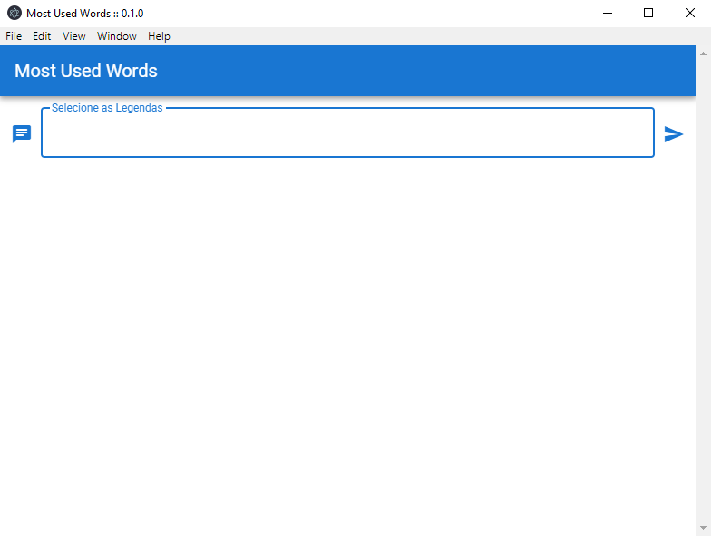
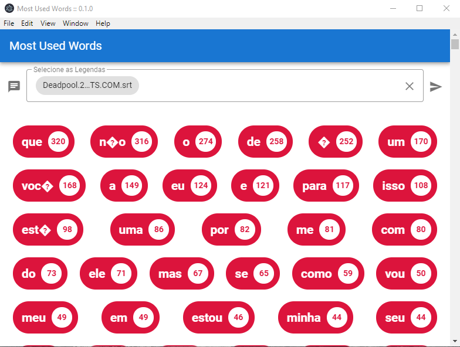

# MOST-USED-WORDS-VUE

# Sobre o projeto

Aplicação desktop desenvolvida em VueJS e capaz de contar quantas palavras foram faladas em um arquivo de legenda(.srt), Foi utilizado o framework ElectronJS que permite desenvolver aplicações para desktop GUI usando componentes front end e back end originalmente criados para aplicações web. Projeto desenvolvido durante o curso Web-Moderno da Cod3r.

## Imagens da aplicação

### Início



### Executando



# 🚀 Começando

Essas instruções permitirão que você obtenha uma cópia do projeto em operação na sua máquina local para fins de desenvolvimento e teste.

## 📋 Pré-requisitos

- npm / yarn

## 🔧 Instalação
### :warning::warning: **A pasta img-app**: é para guardar as imagens usadas no readme.md! Apagar ela depois do clone :warning::warning:
``` bash
### clonar repositório
git clone https://github.com/PauloCSantos/montyhall-vue.git

## entrar na pasta do projeto
cd most-used-words

## instalar as dependencias
npm install

## executar o projeto
npm run electron:serve
```

## 🛠️ Construído com

- HTML / CSS  
- VueJS
- ElectronJS

## ✒️ Autor

* **Paulo C Santos** - [Linkedin](https://www.linkedin.com/in/paulocsantos1995/)

## 🖐️ Agradecimento

Agradeço a equipe Cod3r e ao professor Leonardo pelo maravilhoso curso de Web-Moderno 

-Link do curso: https://www.udemy.com/course/curso-web/
